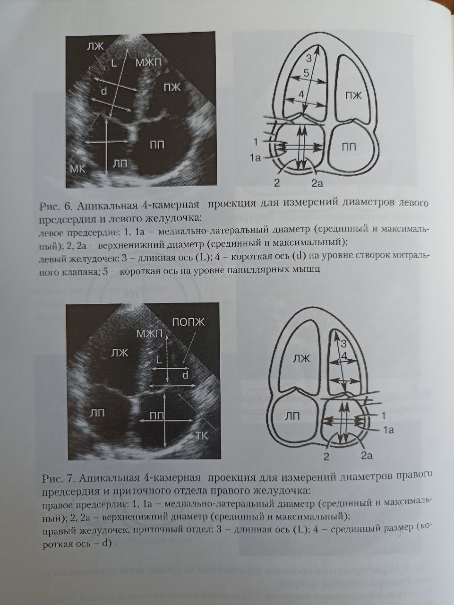
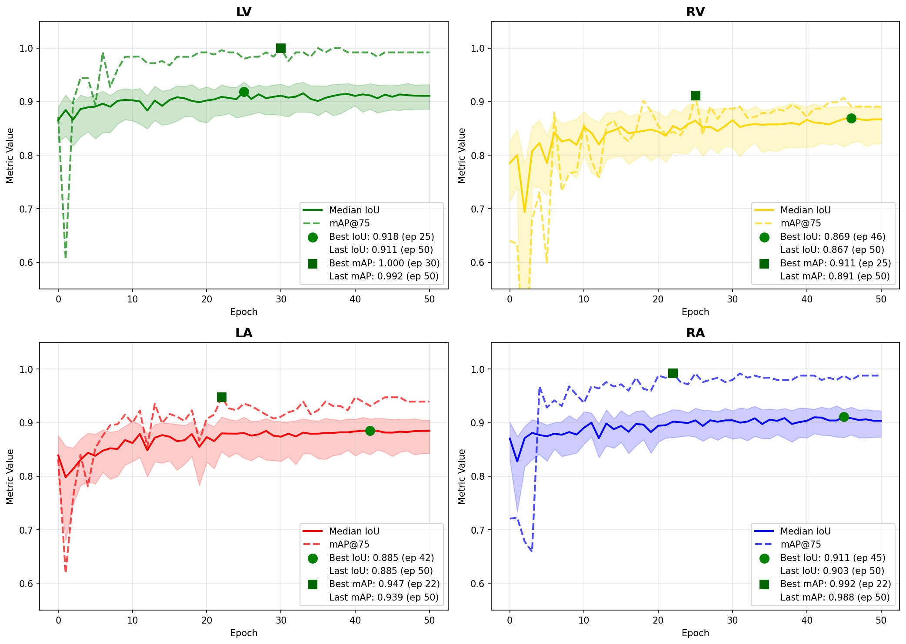
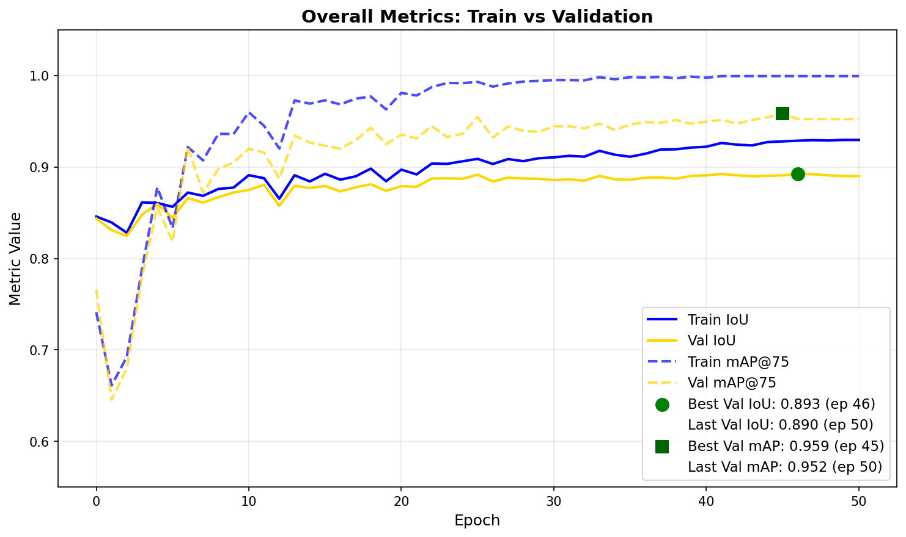
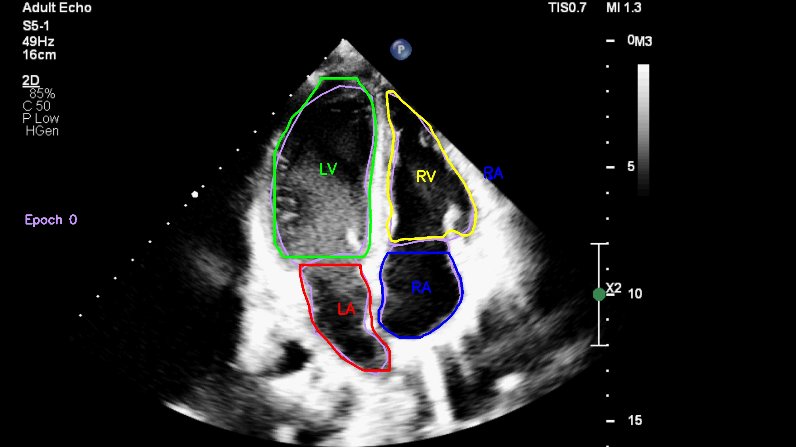
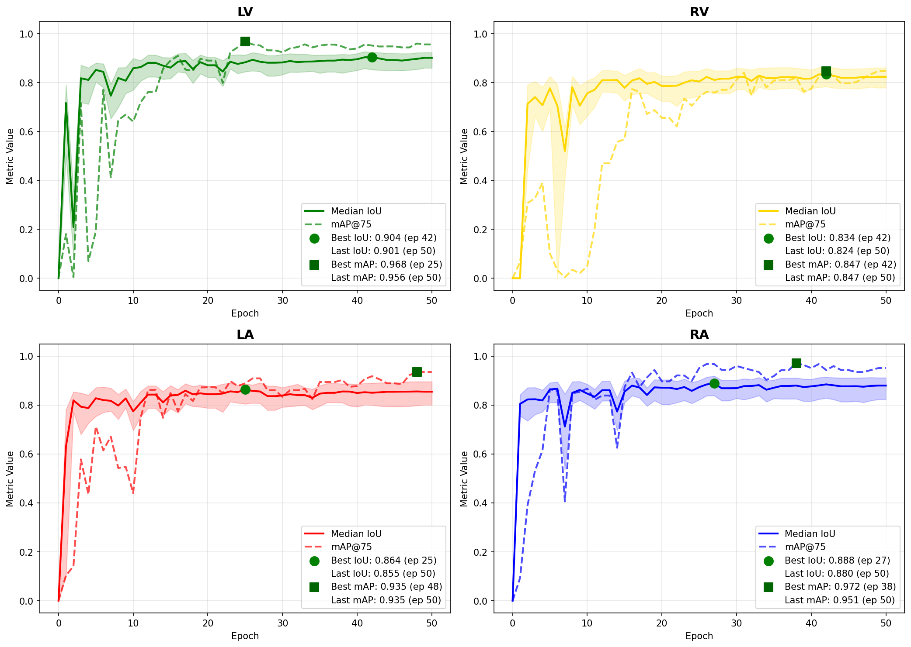
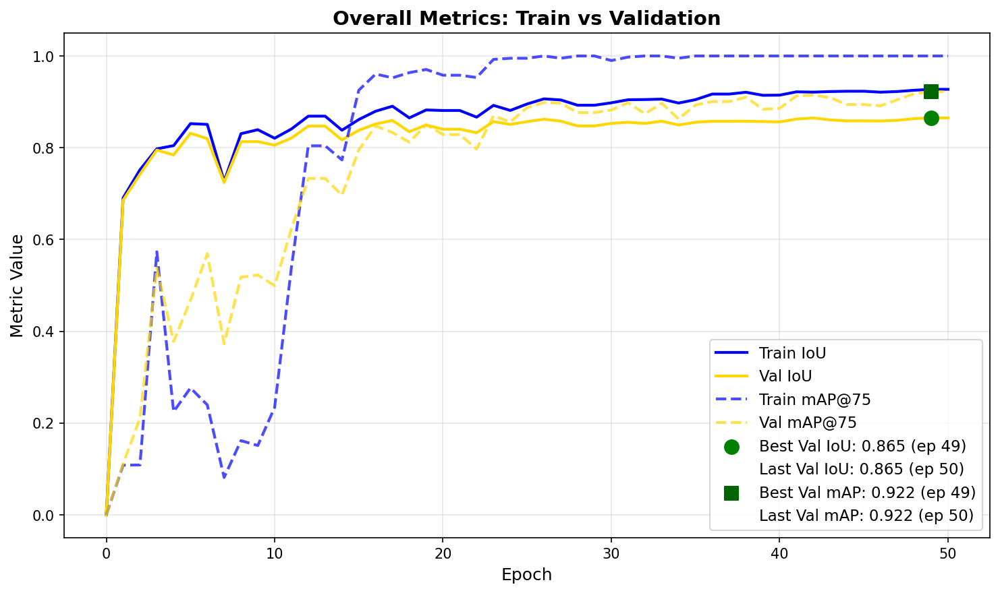
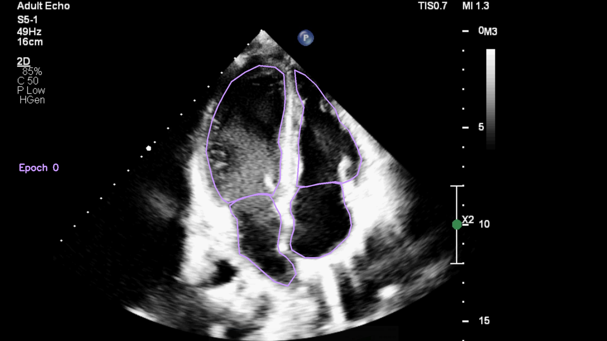
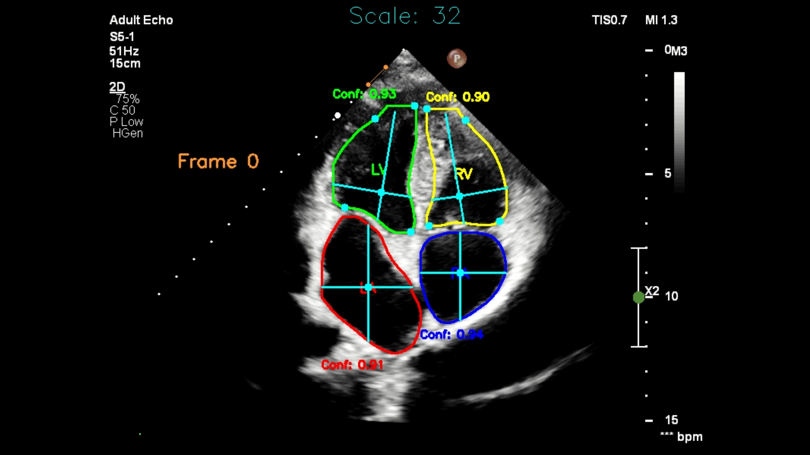
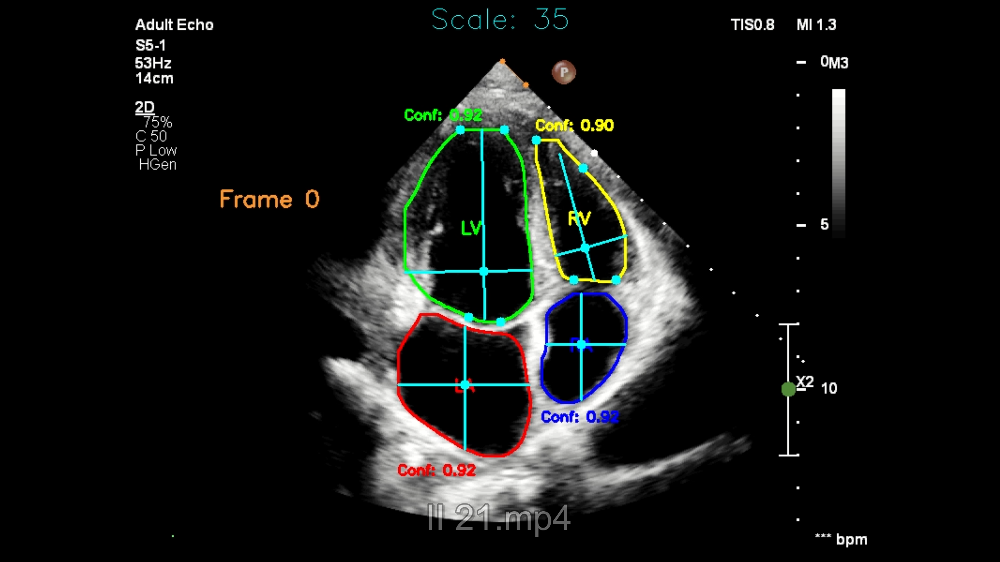

# Создание приложения для автоматизации измерения характеристик сердца по видео УЗИ

*Данный проект разработан на основе медицинской платформы "Экосистема Альфа". Код и данные под NDA. По вопросам сотрудничества прошу писать на почту auglazunov@mail.ru*
## Общая информация о проекте

### Предпосылки проекта

Ультразвуковое исследование сердца (эхокардиография) — один из ключевых методов диагностики состояния сердечно-сосудистой системы. Во время исследования оцениваются морфология и функциональные параметры сердца, позволяющие выявлять сердечную недостаточность и другие патологии.

В типичном рабочем процессе врач выбирает кадры, соответствующие фазам максимального сокращения и расслабления миокарда, и вручную размечает контуры камер сердца. На основе этой разметки затем рассчитываются ключевые характеристики. Процесс занимает в среднем **15–20 минут** на одно исследование.

Проект направлен на **автоматизацию разметки и вычисления параметров сердца**, что позволит значительно сократить время анализа и повысить точность измерений.

### User story

Как специалист по УЗИ, я хочу автоматизировать процесс измерения характеристик сердца по видео УЗИ, чтобы сократить время анализа и повысить точность диагностики.

### Use case

| **Актор** | **Специалист по УЗИ** |
|------------|------------------------|
| **Предусловие** | Получено видео УЗИ длительностью не менее трёх сердечных циклов. Видео сохранено на компьютере с установленным приложением. |
| **Триггер** | Специалист запускает приложение и начинает загрузку видео. |
| **Основной сценарий** | 1. Специалист открывает приложение.<br>2. Загружает видео УЗИ.<br>3. Приложение автоматически обрабатывает видео и выполняет измерения.<br>4. Результаты представляются в виде:<br> • таблицы с рассчитанными характеристиками;<br> • графиков изменения параметров;<br> • размеченного видео для визуальной проверки.<br>5. Специалист просматривает результаты и сохраняет их. |
| **Альтернативный сценарий** | 1. Приложение выявляет ошибку при обработке (например, короткое видео или низкое качество изображения).<br>2. Отображается сообщение с описанием проблемы.<br>3. Специалист может загрузить другое видео или повторить обработку. |

### Требования к продукту

1. **Погрешность измерений** должна составлять менее **15%** в отношении к измеряемым значениям.
2. **Время обработки** одного видео должно исчисляться минутами, а не десятками минут.  
3. **Определяемые характеристики сердца по УЗИ:**

* **Левый желудочек (ЛЖ):**
   - **КДР ЛЖ**  — конечно-диастолический размер  
   - **КСР ЛЖ** — конечно-систолический размер  
   - **КДО ЛЖ** — конечно-диастолический объём  
   - **КСО ЛЖ** — конечно-систолический объём  
   - **ФВ ЛЖ** — фракция выброса, рассчитывается по формуле  

$$
\text{ФВ} = \frac{\text{КДО} - \text{КСО}}{\text{КДО}} \times 100\%
$$

* **Правый желудочек (ПЖ):**
   - **КДР ПЖ** — конечно-диастолический размер правого желудочка  
   - **ФИП ПЖ** — фракция изменения площади, рассчитывается по формуле  

$$
\text{ФИП} = \frac{S_\text{диастолы} - S_\text{систолы}}{S_\text{диастолы}} \times 100\%
$$

* **Соотношение КДР ЛЖ / КДР ПЖ**

### Методы определения параметров

#### 1. КДР и КСР

**КДР  (конечно-диастолический размер)** — максимальный размер сердечных камер в фазе диастолы, когда они полностью заполнены кровью.  
**КСР (конечно-систолический размер)** — минимальный размер камер в фазе систолы, при максимальном сокращении миокарда.  

Эти параметры отражают амплитуду сокращения сердца и служат основой для расчёта объёмов и фракции выброса. Иллюстрация ниже демонстрирует, как можно определить размеры желудочков.



В ходе согласования со специалистами был утверждён следующий алгоритм вычисления КДР и КСР:
1. От середины митрального клапана (для ЛЖ) или трёхстворчатого клапана (для ПЖ) проводится длинная ось до верхушки соответствующего желудочка.  
2. На расстоянии ¼ длины этой оси от основания определяется точка, из которой строятся два перпендикуляра — вправо и влево — до пересечения с границами желудочка.  
3. КДР измеряется в момент максимального расширения желудочка (диастола),  
   а КСР — в момент максимального сокращения (систола).

#### 2. КДО и КСО

**КДО (конечно-диастолический объём)** — объём крови в желудочке в конце диастолы, до начала сокращения. Это максимальный объём, который сердце удерживает после наполнения.  
**КСО (конечно-систолический объём)** — объём крови, остающийся в желудочке после систолы, то есть после выброса крови. Это минимальный объём, фиксируемый в конце сокращения.  

Оба параметра рассчитываются методом аппроксимации объёма по продольным срезам:

1. Желудочек по длинной оси делится на 16 секторов.  
2. Для каждого сектора определяется ширина и высота, по которым строится эквивалентный цилиндрический элемент.  
3. Объём желудочка вычисляется как сумма объёмов всех цилиндров.  

**КДО** измеряется при максимальном размере желудочка(диастола),  
**КСО** — при минимальном(систола).  
На их основе далее рассчитывается фракция выброса.

#### 3. ФИП

**ФИП (фракция изменения площади)** отражает изменение площади поперечного сечения желудочка между диастолой и систолой и служит показателем сократительной способности сердца.  
Площади желудочка в обеих фазах определяются стандартными инструментами из библиотек `Python`.

## Описание решения

Работу конечного продукта можно разделить на два основных этапа:

1. **Сегментация сердечных структур на УЗИ-видео**  
   Чтобы вычислить характеристики сердца, сначала нужно точно выделить интересующие области — предсердия и желудочки — на кадрах УЗИ. Это задача сегментации в компьютерном зрении, где модель должна точно выделять форму и контуры объектов. Для её решения мы используем фреймворк `ultralytics`, реализующий архитектуру `YOLO` (You Only Look Once).

2. **Вычисление параметров сердца**  
   На этом этапе система анализирует сегментированные кадры и извлекает численные характеристики сердца.  
   
   Для каждого кадра видео:
	1. Модель выполняет сегментацию желудочков, получая точные контуры.
	2. На основе сегмента строятся длинная и короткая оси желудочка.
	3. Измеренные значения длин осей сохраняются и агрегируются по всей последовательности кадров.  

   В результате формируется временной ряд изменения длинной и короткой оси в течение нескольких сердечных циклов. По изменению короткой оси определяется набор пиков и минимумов, соответствующих фазам диастолы и систолы.  
   На основании усреднённых значений этих экстремумов вычисляются:
   - **КДР** и **КСР** — конечно-диастолический и конечно-систолический размеры;  
   - далее — **КДО** и **КСО**, рассчитанные по геометрической аппроксимации формы желудочка;  
   - производные параметры: фракция выброса и фракция изменения площади.  

   Отдельная подзадача — определение масштаба изображения: по масштабной линейке на УЗИ-кадрах вычисляется коэффициент перевода из пикселей в сантиметры, что позволяет получать результаты в физических единицах.  

   Для повышения стабильности измерений применяется временная фильтрация, обеспечивающая сглаживание траекторий изменения параметров по кадрам и устранение зашумления из-за артефактов сегментации.

Для реализации описанного подхода потребовалось собрать и подготовить данные, обучить и оценить модель сегментации `YOLO`, а так же оценить качество вычисления параметров сердца.
Сначала кратко опишем данные, затем объясним используемые метрики, а потом расскажем об обучении модели и полученных результатах.

## Данные

Для обучения модели и оценки качества сегментации были собраны и размечены специалистами **623 изображения** ультразвуковых исследований сердца, полученные с аппарата **Philips Affiniti 70**. Данные были разделены на обучающую, валидационную и тестовую выборки в соотношении 0.7:0.2:0.1, соответственно. Размеры выборок составили 436, 124 и 63 изображения.

Для оценки качества определения параметров сердца собраны **25 видео** длительностью от 3 до 5 секунд так же с аппарата **Philips Affiniti 70**. Для каждого видео была предоставлена референтная таблица с параметрами сердца, рассчитанными специалистами, что позволило сравнить предсказания модели с экспертными измерениями.

## Используемые метрики

### Метрики оценки качества сегментации

Для оценки качества сегментации использовались две основные метрики: **IoU (Intersection over Union)** и **mAP@75 (Mean Average Precision при IoU ≥ 0.75)**. Они отражают разные аспекты работы модели.

1. IoU (Intersection over Union)

**IoU** измеряет степень пересечения предсказанной области с истинной (ground truth). Для каждой пары масок рассчитывается доля перекрытия относительно их объединения:

$$
IoU=\frac{S_{пересечения}}{S_{объединения}}
$$

В коде для каждого кадра и класса выбирается лучшее совпадение — предсказанная маска, дающая максимальный IoU с эталонной. Таким образом, IoU показывает, *насколько точно модель способна попасть в контур нужного объекта*, даже если остальные предсказания были неудачными. Это — метрика качества локального наилучшего результата.

2. mAP@75 (Mean Average Precision при IoU ≥ 0.75)

Метрика **mAP@75** оценивает **общую стабильность** работы модели по всем кадрам и классам.  
Для каждого изображения и каждого класса:

1. Вычисляем IoU между каждым предсказанным объектом и каждым реальным объектом этого класса
2. Сопоставляем предсказания с реальными объектами (используя жадный алгоритм по убыванию IoU)
3. Если IoU ≥ 0.75, это **True Positive (TP)** — корректное обнаружение
4. Не сопоставленные предсказания → **False Positive (FP)** — ложное срабатывание
5. Не сопоставленные реальные объекты → **False Negative (FN)** — пропущенный объект.
6. Суммируем TP, FP, FN по всем изображениям для каждого класса отдельно.
7. Вычисляем метрики для каждого класса:

$$
\text{Precision} = \frac{TP}{TP + FP}, \quad \text{Recall} = \frac{TP}{TP + FN}
$$

$$
\text{AP} = \text{F1-score} = \frac{2 \times \text{Precision} \times \text{Recall}}{\text{Precision} + \text{Recall}}
$$

8. Усредненяем по классам:

$$
\text{mAP@75} = \frac{1}{N} \sum_{i=1}^{N} \text{AP}_i
$$

где N — количество классов (в нашем случае 4: LA, LV, RA, RV).

mAP@75, в отличие от IoU, учитывает все предсказания, включая промахи и дубликаты, и тем самым отражает не только способность модели «попасть в цель», но и её надежность и согласованность при обработке всего набора данных.

Обобщая сказанное:

- **IoU** — измеряет _максимальное качество попадания_ по кадру.
- **mAP@75** — оценивает _общую точность и устойчивость_ модели по всему датасету.

### Метрики оценки точности определения параметров сердца

Для оценки точности вычисления параметров сердца использовалась метрика **Mean Absolute Error (MAE)** — средняя абсолютная ошибка между предсказанными моделью и эталонными значениями параметров.

Метрика рассчитывает среднее значение абсолютных расхождений между предсказаниями и истинными (референтными) значениями:

$$
MAE = \frac{1}{N} \sum_{i=1}^{N} |y_i - \hat{y}_i|
$$

где $y_iy$​ — референтное значение параметра, $\hat{y}_i​$ — предсказание модели, $N$ — количество наблюдений.

MAE показывает, насколько в среднем модель ошибается «в единицах измерения параметра» — миллиметрах, миллилитрах или процентах, в зависимости от показателя. Например, MAE = 2.3 мм для КДР означает, что средняя ошибка модели составляет 2.3 мм относительно экспертных измерений.

Почему MAE — показательная метрика для всех параметров.

1. **Интерпретируемость:** она выражена в тех же единицах, что и сами параметры, поэтому её легко соотнести с реальными клиническими масштабами (например, ошибка 3 мм или 4%).
2. **Сравнимость:** все измеряемые параметры (размеры, объёмы, фракции) являются непрерывными количественными величинами, для которых оценка средней абсолютной ошибки одинаково корректна.
3. **Симметричность:** MAE одинаково штрафует как завышенные, так и заниженные предсказания — что идеально подходит при сравнении с экспертными измерениями без систематического смещения.

Недостатком нашего подхода является отсутствие единой интегральной оценки: для сравнения моделей необходимо анализировать ошибки по каждому параметру отдельно. В дальнейшем планируется разработка сводного показателя, агрегирующего MAE по всем параметрам в единую метрику качества. В качестве такой метрики, мог ла бы выступить "Нормализованная MAE (nMAE)" - каждая MAE делится на диапазон или среднее значение параметра в референтных данных, после чего усредняется. Однако это приведёт к потере интерпретируемости ошибки, сложнее будет оценить "какой инструмент дал сбой, плохо рассчитываются оси, или же для определения объёма требуется разделять сегмент на большее количество цилиндров". В общем, есть над чем поработать.

## Результаты

### Пара слов про модель YOLO

Выбрана модель **`YOLOv8m`** — средняя по размеру версия восьмого поколения YOLO, содержащая 25,9 млн параметров. Она способна одновременно выполнять детекцию, классификацию и сегментацию, обеспечивая баланс между скоростью и качеством.
Модель изначально предобучена на датасете COCO (Common Objects in Context) — одном из крупнейших и наиболее универсальных наборов данных в компьютерном зрении.  
В COCO содержится около 330 000 размеченных изображений для обучения и валидации и более 80 категорий объектов, охватывающих широкий спектр сцен — от людей и животных до мебели и транспортных средств.  
Это предобучение даёт модели сильную базовую способность распознавать контуры, формы и текстуры на изображениях самых разных типов. Благодаря этому при последующем дообучении на небольшом специализированном наборе данных УЗИ сердце модель быстрее адаптируется.

### Эксперименты

Были проведены эксперименты с четырьмя архитектурами моделей: **`yolov8n`**, **`yolov8m`**, **`yolov8l`** и **`yolo11m`**. Каждая из них обучалась при разном числе эпох — **10, 25 и 50**, с использованием и без использования **аугментаций данных**. Размер батча во всех экспериментах фиксирован — **8**. По итогам экспериментов лучшей показала себя модель **`yolov8m`**, обученная на полной выборке в **436 изображений** в течение **50 эпох** с включёнными **аугментациями данных**.

### Оценка обучения модели

В ходе обучения на каждой эпохе вычислялись метрики для каждого сегмента, а так же на тренировочной и валидационной выборках.




**Валидация: IoU и mAP@75 по классам**

| Класс | n   | IoU    | IoU IQR       | mAP@75 |
| ----- | --- | ------ | ------------- | ------ |
| LV    | 124 | 0.9109 | 0.8862–0.9317 | 0.9919 |
| RV    | 124 | 0.8670 | 0.8214–0.8894 | 0.8907 |
| LA    | 124 | 0.8846 | 0.8426–0.9048 | 0.9393 |
| RA    | 124 | 0.9035 | 0.8729–0.9226 | 0.9879 |

**Общие метрики**

| Стадия    | n    | IoU    | mAP@75 |
| --------- | ---- | ------ | ------ |
| Обучение  | 1744 | 0.9297 | 0.9994 |
| Валидация | 496  | 0.8901 | 0.9524 |

**Общие тенденции**
- В первые 5–8 эпох — резкий рост IoU и mAP@75, затем плавное насыщение и выход на плато.
- IoU начинает расти сразу с 0.7-0.8 - модель довольно быстро учится определять нужные сегменты, а вот map75 стартует значительно ниже, на некоторых валидационных изображениях наблюдаются множественные ложно-положительные предсказания.
- mAP@75 обычно выходит к плато чуть раньше, чем IoU: модель довольно быстро учится определять сегмент на изображении и не давать ложных срабатываний, однако его точные контуры продолжают уточняться в процессе обучения.
- Ширина доверительного интервала по IoU (IQR) сужается по мере обучения — вариативность сегментации между объектами падает.
- Разрыв train–val небольшой и стабильный: пример 0.03–0.06 по обеим метрикам. Переобучение незначительно.
- Дальнейшие улучшения вероятнее за счет данных/аугментаций/другой модели, чем за счет большего числа эпох.

**По классам**
* LV и RA сегментируются лучше всего. mAP@75 близки к 1 - почти отсутствуют плохие сегментации. Метрики довольно стабильны.
* RV и LA - метрики заметно хуже, больше колебания, особенно в начале обучения. IQR имеет более низкую границу - медиана немного завышена относительно среднего. Более сложные для сегментации классы. Возможно стоит обратить внимание на разметку и уточнить её для этих классов.

Так же в ходе обучения проводилась визуализация предсказаний на некоторых валидационных изображениях. Для наглядной демонстрации процесса обучения было собрано видео для одного объекта: розовым показана разметка специалиста, а каждому сегменту сердца соответствует свой цвет.

<a href="https://github.com/user-attachments/assets/380aa345-2375-477f-b85a-1fbd3ecfd45c">
    
</a>

Видно, что в основном ошибка идёт "в большую сторону" - сегменты определяются больше. Необходимо уточнить разметку, разные изображения могли быть размечены разными специалистами, и их видение разделов сердца может отличаться. В идеале, необходимо собрать несколько вариантов разметки от разных специалистов, а так же таблицы с параметрами по видео и провести оценку для каждого набора данных отдельно, чтобы оценить "алгоритм", а не "модель". Сейчас в проекте не учтён этот человеческий фактор - оценка разных размеров сегментов и характеристик сердца у разных специалистов может отличаться на 10-20%, пример приведён ниже.


IoU по каждому сегменту: <br>
LA: 0.744 <br>
LV: 0.717 <br>
RA: 0.937 <br>
RV: 0.783 <br>

*Вообще говоря, валидации разметки и её анализу стоило бы посвятить отдельный раздел.*

Дополнительно проведена визуализация обучения модели всего на 50 объектах тренировочной выборки с сохранением всего объёма валидационной, для сравнения результатов (масштаб по оси y увеличен).



Выход на плато занимает чуть больше времени, и само плато, как и лучший результат, немного ниже: IoU 0.865 и mAP@75 0.922 против IoU 0.893 и mAP@75 0.959, но это всё ещё неплохие метрики. Это показывает, что даже небольшой набор данных (50 изображений) способен обеспечить близкий к максимальному результат. Не к идеальному равному 1, а к максимальному - с учётом особенностей разметки и прочего, обсуждённого выше.

Однако дальнейшее увеличение числа эпох или размера датасета не приведёт к значительному улучшению качества — плато по метрикам остаётся примерно на этом уровне. Для заметного прироста точности потребуется либо более мощная модель, либо более серьёзные подходы к разметке.

Так же видео обучения модели.

<a href="https://github.com/user-attachments/assets/0f742c92-5e3c-458d-bd51-9406cd7a7a2c">
    
</a>

В отличие от обучения на полной выборке, на первых эпохах заметно больше ложноположительных срабатываний, особенно для LV и RV, что приводит к очень низким значениями map75. Однако итоговая форма определяемых сегментов довольна близка к разметке.

### Оценка определения параметров сердца

Получены метрики по 25 имеющимся видео.

1. Левый желудочек

|          | ЛЖ_КДР | ЛЖ_КСР | ЛЖ_КДД | ЛЖ_КСД | ЛЖ_КДП | ЛЖ_КСП | ЛЖ_КДО | ЛЖ_КСО | ЛЖ_ФВ |
| -------- | ------ | ------ | ------ | ------ | ------ | ------ | ------ | ------ | ----- |
| Ед. изм. | см     | см     | см     | см     | см²    | см²    | см³    | см³    | %     |
| MAE      | 0.42   | 0.37   | 0.86   | 0.93   | 3.33   | 3.96   | 11.59  | 11.53  | 9.46  |
| MAE, %   | 10.04  | 13.16  | 12.33  | 15.55  | 13.73  | 29.09  | 14.99  | 42.42  | 14.30 |


2. Правый желудочек

|         | ПЖ_КДР | ПЖ_КДП | ПЖ_КСП | ПЖ_ФИП |
|---------|--------|--------|--------|--------|
| Ед., изм. | см   | см     | см²    | %      |
| MAE     | 0.38   | 2.62   | 1.82   | 8.29   |
| MAE, %  | 11.94  | 16.06  | 23.15  | 16.06  |

- Скорость обработки - больше 10 кадров в секунду. То есть видео длительностью 4 секунды обрабатывается за 10-12 секунд.
* Среднее отклонение значений определённых моделью параметров от оценок специалистов по большинству параметров - **около 15%**.

## Результат работы приложения

1. Приложение отдаёт таблицу с результатами замеров характеристик сердца.
2. Размеченное видео, по котором специалист может оценить точность работы приложения.
3. Графики измерения характеристик сердца во времени. По ним можно оценить динамику работы сердца.

Примеры приведены ниже.

**Примеры видео**

<div style="display: flex;">
    <a href="https://github.com/user-attachments/assets/8cb213d9-e93d-41ed-8dba-a262f154cad8">
        
    </a>
    <a href="https://github.com/user-attachments/assets/8efcb1d6-cf08-4650-9e8d-876fefe91650">
        
    </a>
</div>

На видео отмечаются следующие элементы:
1. Границы и названия сегментов, а так же параметр confidence, который характеризует "насколько модель уверена в том, что найденная маска действительно существует в этом месте". Зеленым - левый желудочек, жёлтым - правый, красным - левое предсердие, синим - правое.
2. Короткие и длинные оси, опорные точки для желудочков и центры сегментов для предсердий, по которым строятся оси. Выделены бирюзовым цветом.
3. Сверху посередине выводится значение масштаба в "пикселей на сантиметр", а на масштабной линейке оранжевым отрезком отображается расстояние между точками, по которым этот масштаб определён.

**Примеры графиков изменения характеристик**

<p float="left">	
  
  
</p>

## Архитектура папок

```
UZI/
│
├── assets/                         # Папка для вложений readme.md
│
├── data/                           # Директория для хранения данных
│   ├─ processed/                   # Обработанные и подготовленные данные для
│   │   │                             моделирования
│   │   ├── datasets/               # Подкаталог для организации наборов данных
│   │   │   ├── train/              # Набор данных для обучения модели
│   │   │   ├── val/                # Набор данных для валидации (проверки) модели
│   │   │   └── test/               # Набор данных для тестирования модели
│   │   └── Elena_marking/          # Разметка, созданная Еленой
│   │
│   └── raw/                        # Исходные неочищенные данные
│       ├── images/                 # Подкаталог для изображений
│       └── videos/                 # Подкаталог для видеофайлов
│           └── videos_II/          # Дополнительный подкаталог для видео
│                                     (возможно, для второй версии)
│
├── notebooks/                      # Директория для Jupyter ноутбуков,
│   │                               # используемых в проекте
│   ├── 0_research                  # Подкаталог с ноутбуками для подробного
│   │                               # описания исследования
│   ├── 1_processing                # Подкаталог с ноутбуками для обработки файлов
│   ├── 2_work                      # Подкаталог для рабочих ноутбуков
│   └── 3_temp                      # Подкаталог для временных файлов
│
├── project_docs/                   # Документация проекта
│       ├── ИИ_ИЮ_25.txt            # Оценка параметров сердца по видео ИИ врачами
│       └── ТЗ для УЗИ 1.1.txt      # Техническое задание проекта в текстовом
│                                     формате
│
├── results/                        # Директория для хранения результатов
│   │                               # экспериментов
│   ├── 0_research                  # Подкаталог для результатов работы ноутбуков
│   │                               # из 0_research
│   ├── 1_processing                # Подкаталог для результатов работы ноутбуков
│   │   │                           # из 1_processing
│   │   └── videos_II               # Подкаталог для обработанных ИИ видео
│   │       └── graphs              # Подкаталог для графиков изменения параметров
│   │                               # сердца на ИИ видео
│   └── 2_work                      # Подкаталог для результатов работы ноутбуков
│                                   # из 2_work
│
├── src/                            # Основная директория с исходным кодом проекта
│   ├── models/                     # Директория для хранения файлов моделей
│   │   └── yolov8m_train436_epoch50_bs8_experiment_25-11-12_10-16.pt                 # Файл с лучшей моделью на данный момент
│   └── UZI.py                      # Скрипт, содержащий код для обработки видео и валидации модели
│                                   # и данным проекта (не используется)
│
├── requirements.txt                # Файл, содержащий список зависимостей
│                                   # (библиотек) проекта для установки (будет
│                                   # добавлен)
├── README.md                       # Документация проекта, описание его целей,
│                                   # структуры и инструкции по использованию
└── .gitignore                      # Файл, указывающий на файлы и папки, которые
                                    # не должны быть включены в систему контроля
                                    # версий git

```

