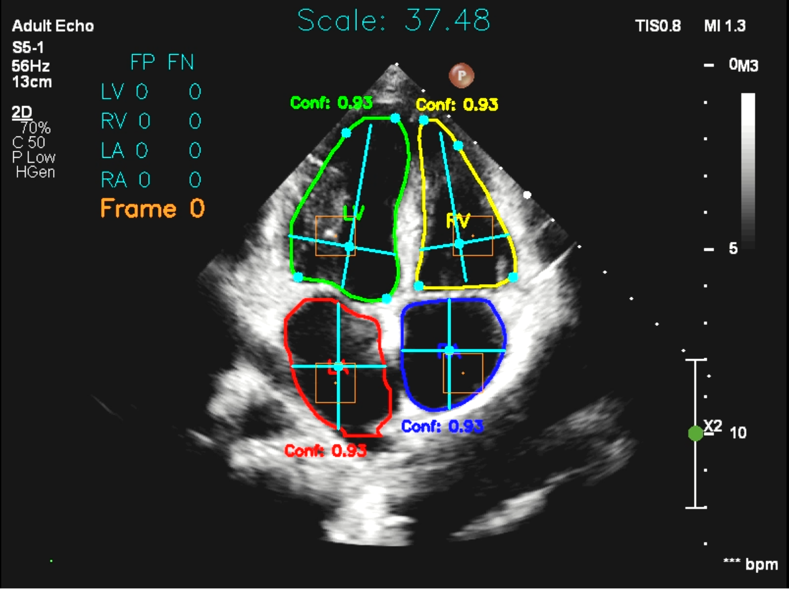
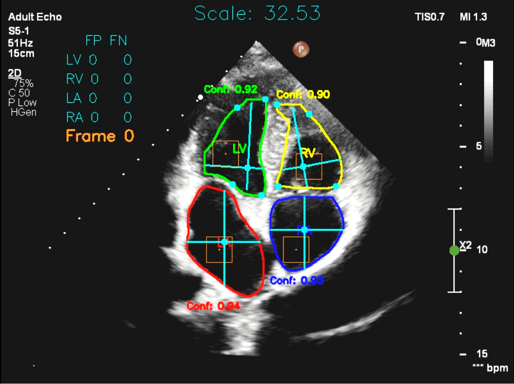
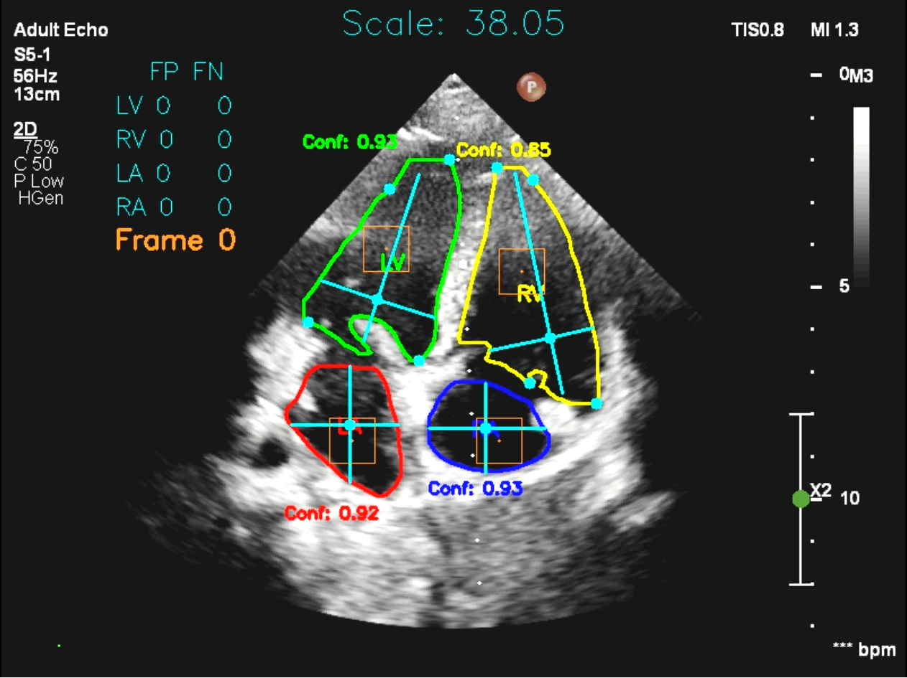
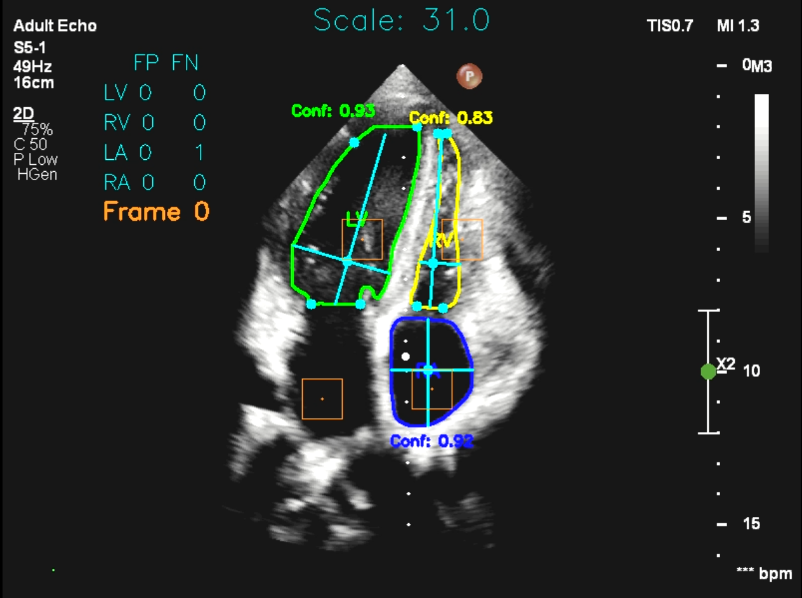

# Создание приложения для автоматизации измерения характеристик сердца по видео УЗИ
## Общая информация о проекте
### Потребности, приведшие к созданию данного проекта
Ультразвуковое исследование сердца (УЗИ), также известное как эхокардиография, является ключевым методом для диагностики и оценки состояния сердечно-сосудистой системы. Во время проведения УЗИ выполняются не только визуальные обследования структур сердца, но и расчеты различных характеристик, которые играют важную роль в оценке состояния сердечно-сосудистой системы. Это включает диагностирование таких состояний, как сердечная недостаточность и другие патологии. 

В ходе исследования специалист по УЗИ выбирает несколько изображений, соответствующих моментам максимального сокращения и расширения сердечной мышцы, и проводит их полуавтоматическую разметку. На основе этой разметки вычисляются необходимые характеристики. Процесс занимает около 15-20 минут рабочего времени специалиста. 

Создание данного проекта вызвано потребностью в автоматизации этапа разметки и вычисления необходимых характеристик, с целью сокращения времени, необходимого для обработки и повышения точности измерений.

### User story
Как специалист по УЗИ, я хочу автоматизировать процесс измерения характеристик сердца по видео УЗИ, чтобы сократить время, затрачиваемое на анализ данных и повысить точность измерений.

### Use case

|                                   |                                                                                                                                                                                                                                                                                                                                                                                                                     |
| --------------------------------- | ------------------------------------------------------------------------------------------------------------------------------------------------------------------------------------------------------------------------------------------------------------------------------------------------------------------------------------------------------------------------------------------------------------------- |
| Действующее лицо                  | Специалист по УЗИ                                                                                                                                                                                                                                                                                                                                                                                                   |
| Предусловие                       | Получено видео УЗИ длинной не менее 3 цикла сердца.<br>Видео загружено на компьютер с установленным приложением.                                                                                                                                                                                                                                                                                                    |
| Триггер                           | Приложение запущено, и специалист начинает процесс загрузки видео                                                                                                                                                                                                                                                                                                                                                   |
| Описание основного сценария       | 1. Специалист открывает приложение.<br>2. Специалист загружает видео в приложение.<br>3. Приложение обрабатывает видео.<br>4. Приложение выгружает результаты в:<br>     - Таблицу с измеренными характеристиками сердца.<br>     - Графики изменения характеристик сердца.<br>     - Размеченное видео для проверки корректности обработки.<br>  5. Специалист проверяет результаты и сохраняет или использует их. |
| Описание альтернативного сценария | 1. Приложение обнаруживает проблему при обработке видео.<br>2. Приложение отображает сообщение об ошибке, указывая на причину отказа (например, недостаточная длина видео, плохое качество изображения и т.д.).<br>3. Специалист может принять меры для решения проблемы, например, загрузить другое видео или повторить попытку обработки.                                                                         |

### Требования к продукту
* Ожидаемая погрешность работы продукта должна составлять менее **15%**, от предсказанных специалистом по УЗИ значений, что, судя по промежуточным результатам, является вполне достижимым требованием.
* Обработка должна выполняться за разумный промежуток времени и исчисляться минутами.
* Характеристики сердца, которые должны определяться по УЗИ:
1. Левый желудочек (далее ЛЖ):
	1.1. КДР – конечно-диастолический размер.
	1.2. КСР - конечно-систолический размер.
	1.3. КДО - конечно-диастолический объем.
	1.4. КСО - конечно-систолический объем.
	1.5. ФВ – фракцию выброса. (КДО - КСО) / КДО * 100%
2. Правый желудочек (далее ПЖ):
	2.1. КДР ПЖ.
	2.2. ФИП – фракция изменения площади. (S_Диастолы – S_Систолы) / S_Диастолы. Норма ФИП 36%
3. КДР ЛЖ/КДР ПЖ 
### Методы определения параметров

#### 1. КДР и КСР

КДР (конечно-диастолический размер) — это максимальный размер, который достигает сердце в диастолу, когда сердечные камеры наполнены кровью. КСР (конечно-систолический размер) — это размер сердца в систолу, когда сердечная мышца сокращается и выталкивает кровь из камер. Более подробное описание приведено на изображении ниже.


В ходе согласования со специалистами был принят следующий алгоритм расчета КДР и КСР (здесь алгоритм описан в общих чертах, более подробное описание находится в `notebooks/0_research/1_visualization_image.ipynb`):
1. От середины митрального (для ЛЖ) или трёстворчатого (для ПЖ) клапана до вершины желудочка строится длинная ось.
2. На расстоянии 1/4 от начала длинной оси откладывается точка, от которой рисуется два перпендикуляра вправо и влево, до границ желудочка.
Соответственно КДР определяется при максимальном размере желудочка, КСР при минимальном.

#### 2. КДО и КСО

КДО (конечно-диастолический объем) — это объём крови, который присутствует в желудочках сердца в конце диастолы, перед следующим систолическим сокращением. Это максимальный объём, который может находиться в желудочках после их наполнения кровью. КСО (конечно-систолический объем) — это объём крови, который остаётся в желудочках после систолы, то есть после сокращения сердца. Это минимальный объём крови в желудочках, который сохраняется в конце систолы. Эти два параметра рассчитываются *методом (каким?)*.
1. Желудочек по длинной оси разделяется на 16 секторов.
2. По ширине и высоте каждого сектора строится цилиндр.
3. Рассчитывается объём каждого цилиндра, объёмы суммируются.
Соответственно КДО определяется при максимальном размере желудочка, КСО при минимальном. На основе этих параметров рассчитывается ФВ

#### 3. ФИП
ФИП (фракция изменения площади) — это соотношение изменения площади поперечного сечения сердца (обычно желудочка) между диастолой (расслаблением) и систолой (сокращением). Это значение позволяет оценить, насколько хорошо сердце сокращается и, соответственно, насколько оно эффективно перекачивает кровь. Площадь желудочка в диастоле и систоле определяется стандартными инструментами из библиотек `python`. По ним рассчитывается ФИП.

## Данные

Для решения поставленной задачи собраны и размечены около 200 картинок для обучения модели. Тестирование модели происходит на 25 видео. Все данные получены с помощью аппарата **Philips Affiniti 70**.

## Описание решения

Задача разделена на три подзадачи:
1. Сегментация сердечных структур на УЗИ видео: 
   - **Модель**: Выбрана модель `YOLOv8`, которая дообучена на размеченных изображениях УЗИ. Альтернативный подход с использованием модели `MaskRCNN` не дал желаемых результатов, вероятно, из-за недостаточного объема тренировочной выборки. Рассматривалась также предобученная `U-Net`.
   - **Документация**: Подробности можно найти в *ноутбук в разработке*.

2. Вычисление параметров по сегментам:
   - **Инструменты**: Разработаны классы `Visualization` и `Video_processing`, объединенные в библиотеку `UZI.py`. Детали разработки описаны в `notebooks/0_research/1_visualization_image.ipynb` и `notebooks/0_research/2_visualization_video.ipynb`.

3. Оценка результатов:
   - **Первая задача**: Используется метрика точности (accuracy), которая рассчитывается в три этапа: сначала для каждого сегмента из единицы вычитается соотношение ошибок к количеству кадров, затем для каждого видео вычисляется среднее значение метрики по всем сегментам, и после этого итоговая метрика получается усреднением метрик по всем видео. Поскольку количество кадров во всех видео незначительно варьируется (100-120 кадров), итоговая метрика усредняется по всем видео без взвешивания. Задача рассматривается как задача классификации, чтобы оценить способность модели правильно распознавать сегменты.
   - **Вторая задача**: Применяется метрика среднеквадратичного отклонения `MAE` для интерпретации средних отклонений параметров, рассчитанных моделью, по сравнению с экспертной оценкой.
   - **Документация**: Для реализации оценки создан и размещен в `UZI.py` класс `Evaluation`.

## Результаты

На данный момент по 25 видео достигнуты следующие результаты:
* Скорость обработки - больше 10 кадров в секунду. То есть видео длительностью 4 секунды обрабатывается за 10-12 секунд.
* `Accuracy` - **0.91**
* `MAE` (КДД и КСД - длинная ось):

Левый желудочек

| ЛЖ_КДР | ЛЖ_КСР | ЛЖ_КДД | ЛЖ_КСД | ЛЖ_КДП | ЛЖ_КСП | ЛЖ_КДО | ЛЖ_КСО | ЛЖ_ФВ |
| ------ | ------ | ------ | ------ | ------ | ------ | ------ | ------ | ----- |
| см     | см     | см     | см     | cм^2   | cм^2   | cм^3   | cм^3   | %     |
| 0.41   | 0.46   | 0.45   | 0.94   | 3.44   | 3.98   | 14.00  | 13.01  | 10.84 |

Правый желудочек

| ПЖ_КДР | ПЖ_КДП | ПЖ_КСП | ПЖ_ФИП |
| ------ | ------ | ------ | ------ |
| см     | см     | cм^2   | %      |
| 0.36   | 2.23   | 1.55   | 7.39   |

* Среднее отклонение значений определённых моделью параметров от оценок специалистов - **менее 15%**.

### Примеры видео
Для воспроизведения откройте в новой вкладке:

<div style="display: flex;">
    <a href="https://github.com/user-attachments/assets/fda442f7-77bf-4684-b112-579ef0672533">
        
    </a>
    <a href="https://github.com/user-attachments/assets/b677f43a-0534-4cb7-9786-f1f9d5af137d">
        
    </a>
    <a href="https://github.com/user-attachments/assets/8a9a9c0b-75da-4749-beef-f648a3b2c17f">
        
    </a>
    <a href="https://github.com/user-attachments/assets/0c15bcb2-480d-4daa-aa94-9165494c3cf2">
        
    </a> 
</div>

На видео отмечаются следующие элементы:
1. Границы и названия сегментов, а так же параметр conidence, который характеризует "насколько модель уверена в том, что bbox содержит нужный нам объект". Зеленым - левый желудочек, жёлтым - правый, красным - левое предсердие, синим - правое.
2. Короткие и длинные оси, опорные точки для желудочков и центры сегментов для предсердий, по которым строятся оси. Выделены бирюзовым цветом.
3. Квадраты "истинной разметки", по которым определяется ошибки детекции. Отмечены оранжевым. Если есть пересечение нужного квадрата и сегмента (например верхний правый квадрат и левый желудочек), значит сегмент определён верно. Если отсутствует пересечение - ошибка FN. Если происходит неправильное пересечение - ошибка FP.
4. В середине сверху кадра масштаб пиксели/см, сверху слева статистика по ошибкам и номер кадра.

### Примеры графиков изменения характеристик
По итогам обработки видео так же строятся графики изменения характеристик:

<p float="left">
  
   	
  
   
  
  
</p>

## Архитектура папок

```
UZI/
│
├── assets/                         # Папка для вложений readme.md
│
├── data/                           # Директория для хранения данных
│   ├─ processed/                   # Обработанные и подготовленные данные для
│   │   │                             моделирования
│   │   ├── datasets/               # Подкаталог для организации наборов данных
│   │   │   ├── train/              # Набор данных для обучения модели
│   │   │   ├── val/                # Набор данных для валидации (проверки) модели
│   │   │   └── test/               # Набор данных для тестирования модели
│   │   └── Elena_marking/          # Разметка, созданная Еленой
│   │
│   └── raw/                        # Исходные неочищенные данные
│       ├── images/                 # Подкаталог для изображений
│       └── videos/                 # Подкаталог для видеофайлов
│           └── videos_II/          # Дополнительный подкаталог для видео
│                                     (возможно, для второй версии)
│
├── docs/                           # Документация проекта
│   ├── ИИ_ИЮ_26.txt                # Оценка параметров сердца по ИИ видео,
│   │                               # выполненная врачами
│   └── ТЗ для УЗИ 1.1.txt          # Техническое задание проекта, описывающее его
│                                   # цели и требования
│
├── models/                         # Директория с исходным кодом проекта
│   └── best.pt                     # Дообученная модель
│
├── notebooks/                      # Директория для Jupyter ноутбуков,
│   │                               # используемых в проекте
│   ├── 0_research                  # Подкаталог с ноутбуками для подробного
│   │                               # описания исследования
│   ├── 1_processing                # Подкаталог с ноутбуками для обработки файлов
│   ├── 2_work                      # Подкаталог для рабочих ноутбуков
│   └── 3_temp                      # Подкаталог для временных файлов
│
├── project_docs/                   # Документация проекта
│       ├── ИИ_ИЮ_25.txt            # Оценка параметров сердца по видео ИИ врачами
│       └── ТЗ для УЗИ 1.1.txt      # Техническое задание проекта в текстовом
│                                     формате
│
├── results/                        # Директория для хранения результатов
│   │                               # экспериментов
│   ├── 0_research                  # Подкаталог для результатов работы ноутбуков
│   │                               # из 0_research
│   ├── 1_processing                # Подкаталог для результатов работы ноутбуков
│   │   │                           # из 1_processing
│   │   └── videos_II               # Подкаталог для обработанных ИИ видео
│   │       └── graphs              # Подкаталог для графиков изменения параметров
│   │                               # сердца на ИИ видео
│   └── 2_work                      # Подкаталог для результатов работы ноутбуков
│                                   # из 2_work
│
├── src/                            # Основная директория с исходным кодом проекта
│   ├── models/                     # Директория для хранения файлов моделей
│   │   ├── base.pt                 # Файл с базовой моделью
│   │   └── best.pt                 # Файл с лучшей моделью на данный момент
│   └── UZI_paths.py                # Скрипт, содержащий класс с путями к ресурсам
│                                   # и данным проекта (не используется)
│
├── requirements.txt                # Файл, содержащий список зависимостей
│                                   # (библиотек) проекта для установки (будет
│                                   # добавлен)
├── README.md                       # Документация проекта, описание его целей,
│                                   # структуры и инструкции по использованию
└── .gitignore                      # Файл, указывающий на файлы и папки, которые
                                    # не должны быть включены в систему контроля
                                    # версий git

```

